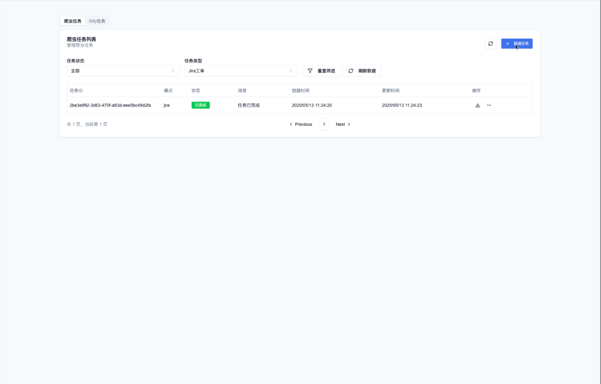
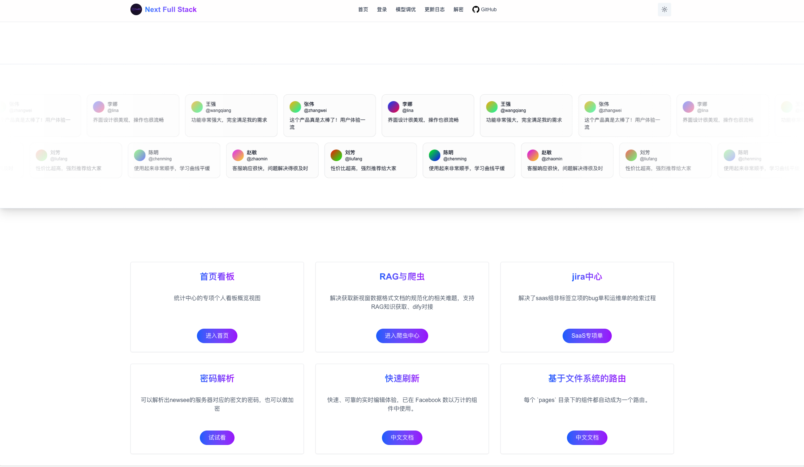
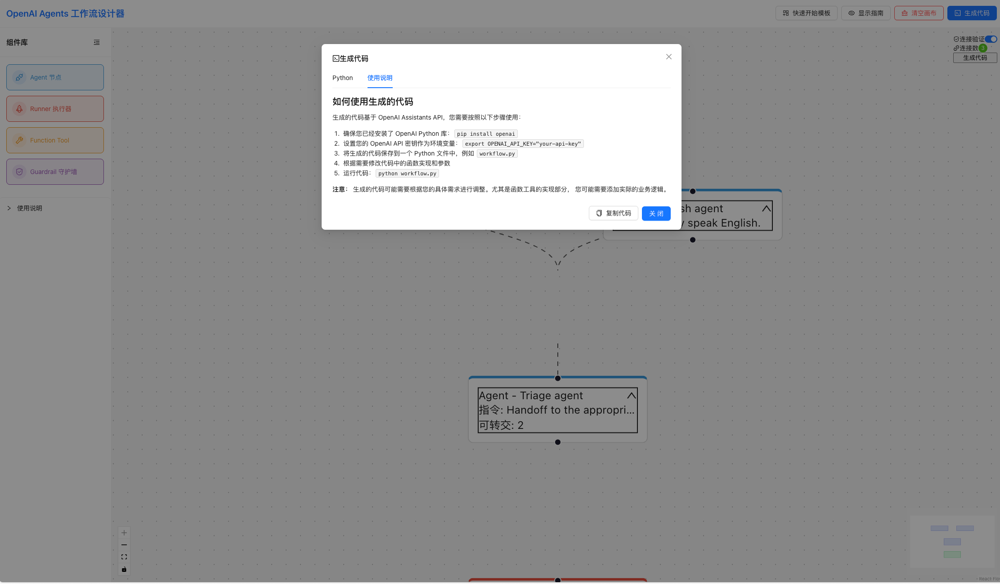
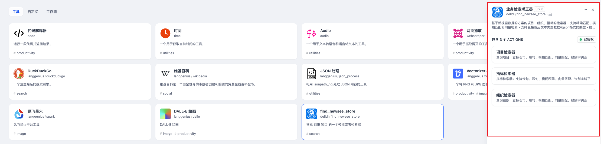

<p align="center">
  
</p>

<div align="center">

  [](https://git.io/streak-stats)
  [](https://github.com/anuraghazra/github-readme-stats)

</div>

## 🚀 技术栈 & 工具

### 编程语言


### 前端技术


### 后端技术


## 🌟 明星项目

| 项目 | 描述 | 技术栈 | 演示 |
|------|------|--------|------|
| **[AI智能工具](https://github.com/DellDi/tools-aigc)** | AI智能工具 | Python, FastAPI |  |
| **[scrapy-service](https://github.com/DellDi/kms-scrapy)** | 一个爬虫服务面向jira系统、kms知识库、dify知识库上传 | Python, Scrapy, fastAPI |  |
| **[fastify-tools](https://github.com/DellDi/fastify-tools)** | 面向个人的 [Full-Stack](https://dify.yswg360.com/next) Fastify tools | TypeScript, Next.js, NestJS |  |
| **[tools-aigc](https://github.com/DellDi/tools-aigc)** | 通用OpenAI兼容模型的function call工具集合调用服务 | Python, FastAPI, PostgreSQL | [文档](https://github.com/DellDi/tools-aigc/blob/main/README.md) |
| **[openai-agents-workflow-designer](https://github.com/DellDi/openai-agents-workflow-designer)** | 一个可视化工具，帮助用户设计、配置和生成基于OpenAI Assistants API的多代理工作流系统。 | Python, openai |  |
| **[dingtalk-ai-robot](https://github.com/DellDi/dingtalk-ai-robot)** | 钉钉AI机器人 - 问答、提单、日志、jira审核 | Python, FastAPI, AutoGen |  |
| **[dify-plugins](https://github.com/DellDi/dify-plugins)** | Dify-速查校准检索插件（业务） | Python, chrome, transform |  |
| **[AutoGen FastAPI PostgreSQL](https://github.com/DellDi/autogen-fastapi-postgres)** | AutoGen FastAPI PostgreSQL | Python, FastAPI, PostgreSQL |  |
## 📈 活跃度统计

<div align="center">

  

</div>

## 🎯 近期目标

- [x] 完成autogen相关api的初始化和数据库设计
- [ ] 完成autogen-fastapi-postgres：支持意图识别、分词技术
- [ ] 完成tools-aigc 支持langchain

## 🤖 趣味数据

```text
🌱 本周编码时长:   25 hrs 30 mins
📚 正在学习:      Rust & WebAssembly
🎵 当前播放:      Coding Lofi Hip Hop
```

## 📫 联系我

[](mailto:delldi808611@outlook.com)


⭐ 来自 [DellDi](https://github.com/DellDi) | 最后更新于: 
