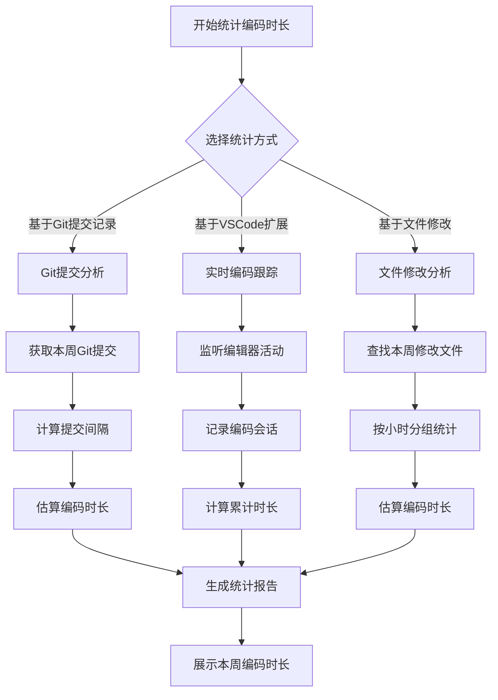

# 编码时长统计工具

本工具集提供了多种方法来动态获取和统计本周编码时长，帮助你了解自己的编码习惯和效率。

## 功能流程图



## 方案对比

| 方案 | 优点 | 缺点 | 适用场景 |
|------|------|------|----------|
| Git提交分析 | 无需额外工具，基于已有Git记录 | 依赖提交频率，可能不够精确 | 有规律提交代码的项目 |
| VSCode扩展 | 实时精确统计，可视化展示 | 需要安装扩展，仅限VSCode | 需要精确统计的开发者 |
| 文件修改分析 | 简单快速，无需特殊配置 | 精度较低，可能包含非编码修改 | 快速了解大致编码量 |

## 使用方法

### 方案一：基于Git提交记录

```bash
# TypeScript版本
npm run coding-time

# Python版本
npm run coding-time:py
# 或直接运行
python scripts/coding_time.py
```

### 方案二：VSCode扩展

1. 进入扩展目录：`cd scripts/vscode-extension/coding-time-tracker`
2. 安装依赖：`npm install`
3. 编译扩展：`npm run compile`
4. 在VSCode中按F5调试运行，或打包后安装

### 方案三：基于文件修改时间

```bash
# 直接运行
npx ts-node scripts/quick-coding-time.ts
```

## 技术栈

- TypeScript/Node.js
- Python 3
- VSCode Extension API
- Git命令行工具
